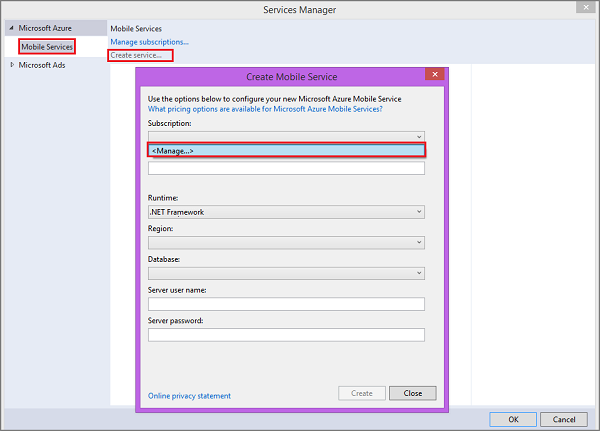
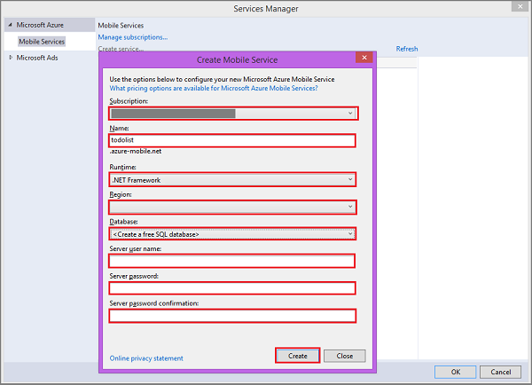

下列步驟將在 Azure 中建立新的行動服務，並將可連接應用程式和此新服務的程式碼加入您的專案。Visual Studio 2013 能使用您提供的認證代替您連接 Azure，以便建立新的行動服務。建立新的行動服務時，您必須指定該行動服務用來儲存應用程式資料的 Azure SQL Database。

1. 在 Visual Studio 2013 中，開啟 [方案總管]、以滑鼠右鍵按一下 Windows 市集應用程式專案，然後依序按一下 [新增] 和 [已連接服務]。 

2. 在 [服務管理員] 對話方塊中，按一下 [建立服務...]，然後從 [建立行動服務] 對話方塊的 [訂閱] 中選取 [&lt;管理...&gt;]。

	

3. 在 [Manage Microsoft Azure Subscriptions] 中，按一下 [登入] 以登入您的 Azure 帳戶 (需要的話)，接著選取可用的訂閱，然後按一下 [關閉]。

	當訂閱已經有一或多個現有的行動服務時，便會顯示這些服務名稱。

5. 回到 [建立行動服務] 對話方塊，選取 [訂閱]、[執行階段] 中的 [.NET Framework] 後端及行動服務的 [區域]，然後輸入行動服務的 [名稱]。

	>[AZURE.NOTE]行動服務名稱必須是唯一的。當您提供的名稱無法使用時，**[名稱]** 旁邊便會顯示一個紅色 X。

6. 在 [資料庫] 中選取 [&lt;建立免費的 SQL Database&gt;]，提供 [伺服器使用者名稱]、[伺服器密碼] 和 [伺服器密碼確認]，然後按一下 [建立]。

  	

	> [AZURE.NOTE]作為本教學課程的一部分，您需要建立新的 SQL Database 執行個體和伺服器。You can reuse this new database and administer it as you would any other SQL Database instance.您只能有一個免費的資料庫執行個體。如果新行動服務的區域已經有資料庫存在，您可以改選現有的資料庫。當您選擇現有的資料庫時，請確保您提供的是正確的登入認證。如果您提供不正確的登入認證，則行動服務會建立在不健全的狀態下。

7. 建立行動服務後，請從 [服務管理員] 中的清單選取新建立的行動服務，然後按一下 [確定]。
 
   	待精靈完成後，系統便會將行動服務專案新增至方案中、安裝必要的 NuGet 套件、將行動服務用戶端程式庫的參考新增至專案中，以及更新專案原始程式碼。

<!---HONumber=July15_HO2-->