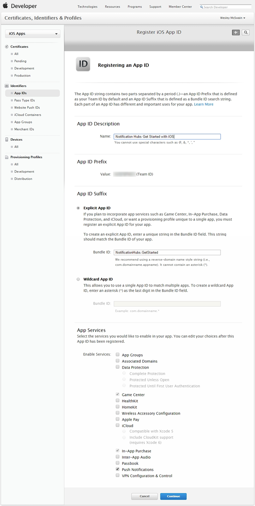
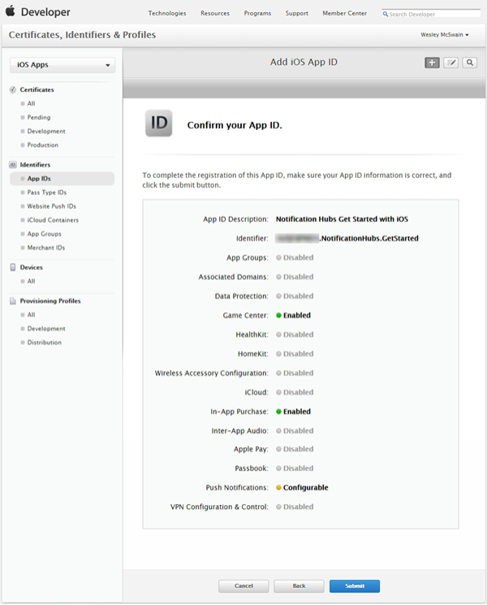
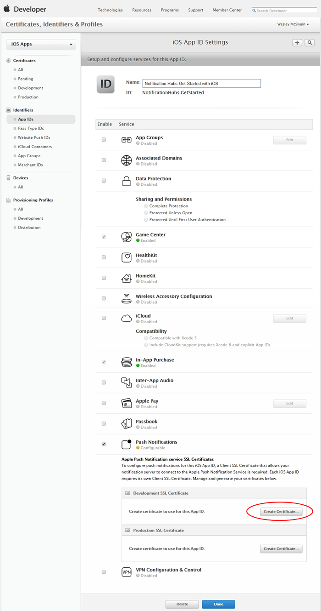
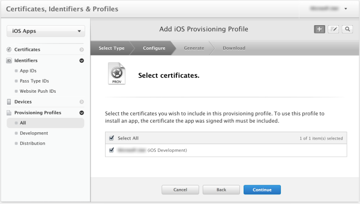
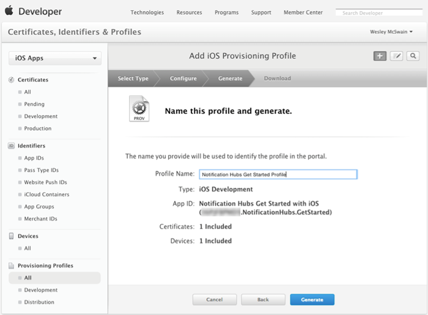
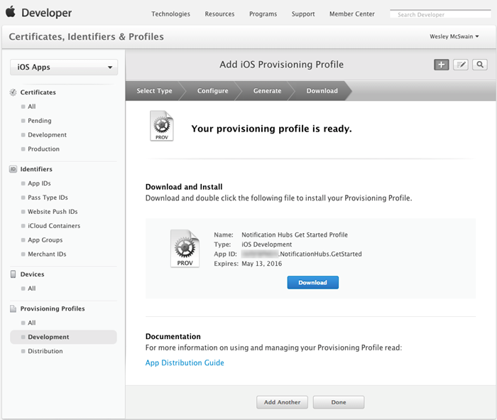

Apple Push Notification Service (APNS) 使用憑證來驗證您的通知服務。遵循下列指示來建立必要的推播憑證，以便傳送和接收通知。如需正式的 APNS 功能文件，請參閱 [Apple 推播通知服務](http://go.microsoft.com/fwlink/p/?LinkId=272584) (英文)。

##產生憑證簽署要求檔案

首先，您必須產生憑證簽署要求 (CSR) 檔案，這將由 Apple 用來產生簽署的推播憑證。

1. 從 **Utilities** 資料夾或 **Other** 資料夾中，執行 Keychain Access 工具。

2. 按一下 [Keychain Access]，並展開 [Certificate Assistant]，然後按一下 [Request a Certificate from a Certificate Authority...]。

  	

3. 選取您的 [使用者電子郵件地址] 和 [一般名稱]，確定已勾選 [Saved to disk]，然後按一下 [繼續]。請將 [CA Email Address] 欄位留空，因為它不是必要資訊。

  	

4. 在 [另存新檔] 中輸入憑證簽署要求 (CSR) 檔案的名稱，並且在 [位置] 中選取位置，然後按一下 [儲存]。

  	

  	這會在選取的位置中儲存 CSR 檔案，預設的位置是在桌面上。請記住為檔案選擇的位置。

接著，您將向 Apple 註冊您的應用程式，並啟用推播通知，然後上傳這個匯出的 CSR 建立推播憑證。

##針對推播通知註冊應用程式

若要將推播通知傳送至 iOS 應用程式，您必須向 Apple 註冊您的應用程式，並註冊進行推播通知。

1. 如果您尚未註冊應用程式，請瀏覽至 Apple 開發人員中心的 <a href="http://go.microsoft.com/fwlink/p/?LinkId=272456" target="_blank">iOS 佈建入口網站</a>，然後使用您的 Apple ID 登入，並按一下 [**識別碼**]，接著按一下 [**應用程式識別碼**]，最後按一下 [**+**] 符號註冊新的應用程式。

   	

2. 在 [**應用程式識別碼描述**] 名稱中輸入您的應用程式中的描述性名稱。

	在 [**明確的應用程式識別碼**] 之下，以[應用程式散發指南](http://go.microsoft.com/fwlink/?LinkId=613485)中所提的 `<Organization Identifier>.<Product Name>` 形式輸入 [**套件組合識別碼**]。您使用的 [*組織識別碼*] 和 [*產品名稱*] 必須符合當您建立 XCode 專案時使用的組織識別碼和產品名稱。在下面的快照中，*NotificationHubs* 做為組織識別碼，*GetStarted* 做為產品名稱。確定這符合您將在 XCode 專案中使用的值，讓您使用正確的發行設定檔搭配 XCode。
	
	勾選 [應用程式服務] 區段中的 [**推播通知**]，然後按一下 [**繼續**]。

	

   	這將產生您的應用程式識別碼，並要求您確定此資訊。按一下 [提交]

    

   	按一下 [提交] 之後，您將看見 [註冊完成] 畫面，如下所示。按一下 [完成]。

    

3. 找出剛才建立的應用程式識別碼，並且按一下該資料列。

   	

   	按一下應用程式識別碼，將顯示應用程式詳細資料。按一下 [**編輯**] 按鈕。

   	

4. 捲動到畫面底部，然後按一下 [Development Push SSL Certificate] 區段下方的 [Create Certificate...] 按鈕。

   	

   	這將顯示 [Add iOS Certificate] 助理。

    > [AZURE.NOTE]本教學課程使用開發憑證。註冊生產憑證時，將使用同一個程序。只要確定在傳送通知時使用相同的憑證類型。

5. 按一下 [選擇檔案]，瀏覽到您在第一個工作中所建立之 CSR 檔案的儲存位置，然後按一下 [產生]。

  	

6. 在入口網站建立憑證之後，依序按一下 [下載] 按鈕和 [完成]。

  	

   	這會下載簽署憑證，並將它儲存到您電腦中的 [下載] 資料夾。

  	

    > [AZURE.NOTE]依預設，下載的檔案 (開發憑證) 的名稱會是 **aps_development.cer**。

7. 按兩下下載的推播憑證 **aps_development.cer**。

   	這樣會將新的憑證安裝在金鑰鏈中，如下所示：

   	

    > [AZURE.NOTE]憑證中的名稱可能會不同，不過字首會加上 **Apple Development iOS Push Services:** 前置詞。

之後，您會使用該憑證來產生 .p12 檔案，以啟用 APNS 驗證。

##建立應用程式的佈建設定檔

1. 返回 <a href="http://go.microsoft.com/fwlink/p/?LinkId=272456" target="_blank">iOS 佈建入口網站</a>，並依序選取 [**佈建設定檔**] 和 [**全部**]，然後按一下 [**+**] 按鈕建立新的設定檔。如此會啟動 **Add iOS Provisiong Profile** 精靈

   	

2. 將 [Development] 下方的 [iOS App Development] 選為佈建設定檔類型，然後按一下 [Continue]。

3. 接著，從 [**應用程式識別碼**] 下拉式清單選取您剛建立的應用程式識別碼，然後按一下 [**繼續**]。

   	

4. 在 [**選取憑證**] 畫面中，選取用於程式碼簽署的一般開發憑證，然後按一下 [**繼續**]。這不是您剛才建立的推播憑證。

   	

5. 接著，選取要用來測試的 [裝置]，然後按一下 [繼續]

   	

6. 最後，在 [Profile Name] 中為設定檔挑選名稱，然後依序按一下 [產生] 和 [Done]

   	

  	這將建立新的佈建設定檔。

   	

<!---HONumber=July15_HO2-->