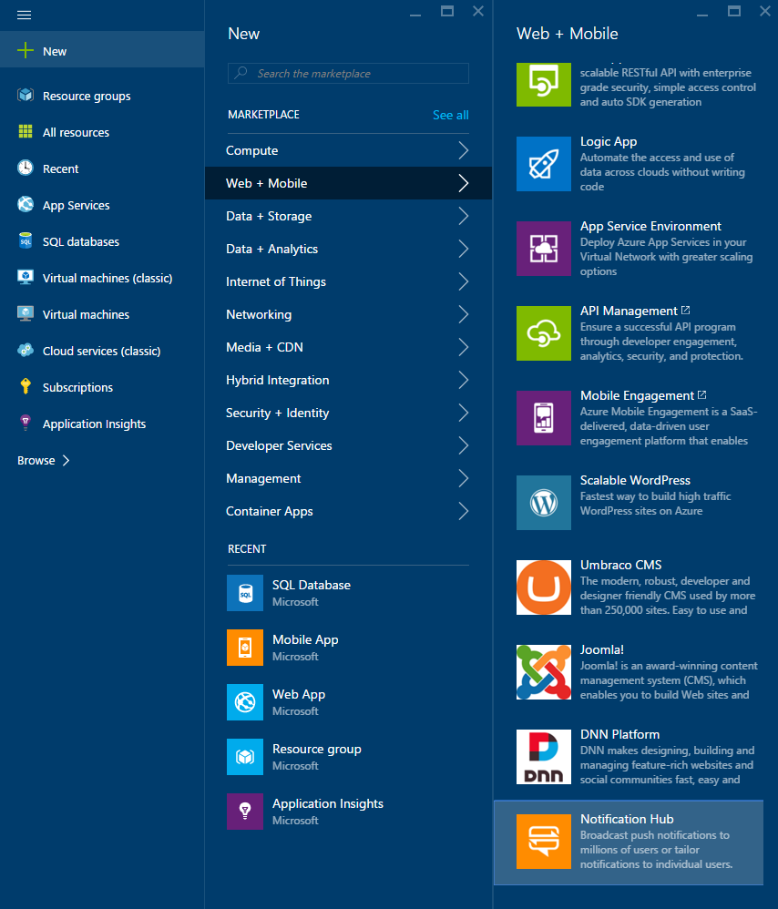

1. Meld u aan bij de [Azure-portal](https://portal.azure.com) en klik op **+NIEUW** linksboven in het scherm.

2. Klik op **Nieuw** en vervolgens op **Web en mobiel**. Schuif indien nodig naar beneden en klik op **Notification Hub**.

    

3. Zorg ervoor dat een unieke naam opgeeft in het veld **Notification Hub**. Selecteer de gewenste **regio**, het **abonnement** en de **resourcegroep** (als u er al een hebt). 
 
    Als u al een Service Bus-naamruimte hebt waarin u de hub wilt maken, selecteert u deze via de optie **Bestaande selecteren** in het veld **Naamruimte**.  U kunt anders de standaardnaam gebruiken die wordt gemaakt op basis van de hubnaam, mits de naam van naamruimtenaam beschikbaar is. 

    Zodra u daarmee klaar bent, klikt u op **Maken**.

    

4. Zodra de naamruimte en de Notification Hub zijn gemaakt, wordt u naar de respectievelijke portalpagina verder geleid. 

    
       
5. Klik op **Instellingen** en vervolgens op **Toegangsbeleid** - noteer de twee verbindingsreeksen die u ter beschikking zijn gesteld, want u hebt ze later nodig als u met pushmeldingen gaat werken.

    

<!--HONumber=sep16_HO1-->

