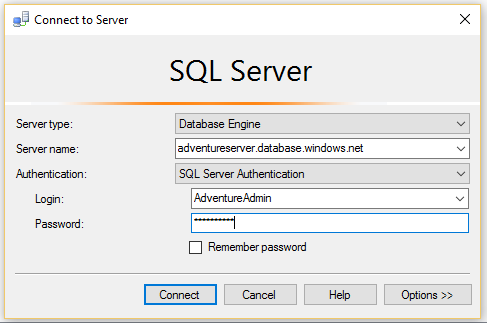
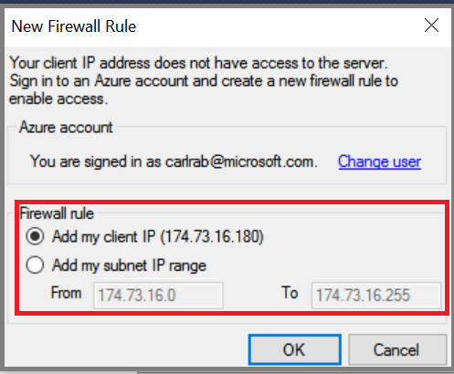
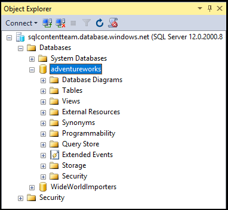

## Verbinding maken met SQL Database met behulp van een principal-aanmelding op serverniveau

Voer de volgende stappen uit als u verbinding wilt maken met Azure SQL Database met SSMS met behulp van een principal-aanmelding op serverniveau.

1. Typ 'Microsoft SQL Server Management Studio' in het zoekvak van Windows en klik vervolgens op de bureaublad-app om SSMS te starten.

2. Voer in het venster Verbinding maken met server de volgende informatie in:

 - **Servertype**: de standaardwaarde is database-engine; verander deze waarde niet.
 - **Servernaam**: voer in de volgende notatie de naam in van de server die als host fungeert voor de SQL-database: *&lt;servernaam>*.**database.Windows.NET**
 - **Verificatietype**: Als u nog maar net begint, selecteer dan SQL-verificatie. Als u Active Directory voor de logische SQL Database-server hebt ingeschakeld, kunt u Active Directory-wachtwoordverificatie of geïntegreerde Active Directory-verificatie selecteren.
 - **Gebruikersnaam**: als u SQL-verificatie of Active Directory-wachtwoordverificatie hebt geselecteerd, voert u de naam in van een gebruiker die toegang heeft tot een database op de server.
 - **Wachtwoord**: als u SQL-verificatie of Active Directory-wachtwoordverificatie hebt geselecteerd, voert u het wachtwoord in van de opgegeven gebruiker.
   
       

3. Klik op **Verbinden**.
 
4. Als het IP-adres van de client geen toegang nodig heeft tot de logische SQL Database-server, wordt u gevraagd om u aan te melden bij een Azure-account en een firewallregel op serverniveau te maken. Als u de beheerder van een Azure-abonnement bent, klikt u op **Aanmelden** om een firewallregel op serverniveau te maken. Als dat niet het geval is, vraagt u een Azure-beheerder om een firewallregel op serverniveau te maken.
 
      
 
1. Als u de beheerder bent van een Azure-abonnement en u zich moet aanmelden, geef dan op de aanmeldingspagina de referenties op voor uw abonnement en meld u aan.

      
 
1. Wanneer uw aanmelding bij Azure is geslaagd, controleert u de voorgestelde firewallregel op serverniveau (u kunt deze wijzigen om een bereik van IP-adressen toe te staan). Klik vervolgens op **OK** om de firewallregel te maken en de verbinding met SQL Database te voltooien.
 
      
 
5. Als uw referenties u toegang verlenen, wordt Object Explorer geopend en kunt u administratieve taken uitvoeren of gegevens opvragen. 
 
     
 
     
## Verbindingsfouten oplossen

De meest voorkomende oorzaak van verbindingsfouten zijn fouten in de servernaam (onthoud, <*servernaam*> is de naam van de logische server, niet van de database), de gebruikersnaam of het wachtwoord, plus het feit dat de server om veiligheidsoverwegingen geen verbinding toestaat. 

<!--HONumber=Jun16_HO2-->

