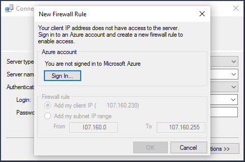

## Verbinding maken met Azure SQL Database met behulp van SQL Server-verificatie

In de volgende stappen wordt uitgelegd hoe u verbinding maakt met een Azure SQL-server en -database met behulp van SSMS. Als u geen server en database hebt, raadpleegt u [Een SQL-database maken in enkele minuten](../articles/sql-database/sql-database-get-started.md) om er een te maken.

1. Start SSMS door **Microsoft SQL Server Management Studio** in het zoekvak van Windows te typen en vervolgens op de bureaublad-app te klikken.

2. Voer in het venster **Verbinding maken met server** de volgende gegevens in (als SSMS al wordt uitgevoerd, klikt u op **Verbinding maken > Database-engine** om het venster **Verbinding maken met server** te openen):

 - **Servertype**: de standaardwaarde is database-engine; verander deze waarde niet.
 - **Servernaam**: voer de volledig gekwalificeerde naam van de Azure SQL Database-server in met de volgende notatie: *&lt;servernaam>*.**database.windows.net**
 - **Verificatietype**: in dit artikel wordt uitgelegd hoe u verbinding maakt via **SQL Server-verificatie**. Voor meer informatie over het maken van een verbinding met Azure Active Directory raadpleegt u [Verbinding maken met behulp van geïntegreerde Active Directory-verificatie](../articles/sql-database/sql-database-aad-authentication.md#connect-using-active-directory-integrated-authentication), [Verbinding maken met behulp van Active Directory-wachtwoordverificatie](../articles/sql-database/sql-database-aad-authentication.md#connect-using-active-directory-password-authentication) en [Verbinding maken met behulp van universele Active Directory-verificatie](../articles/sql-database/sql-database-ssms-mfa-authentication.md).
 - **Gebruikersnaam**: voer de naam in van een gebruiker die toegang heeft tot een database op de server (zoals de *serverbeheerder* die u hebt ingesteld toen u de server maakte). 
 - **Wachtwoord**: voer het wachtwoord voor de opgegeven gebruiker in (zoals het *wachtwoord* dat u hebt ingesteld toen u de server maakte).
   
       

3. Klik op **Verbinden**.
 
4. Voor nieuwe servers zijn standaard geen [firewallregels](../articles/sql-database/sql-database-firewall-configure.md) gedefinieerd, zodat clients in eerste instantie worden geblokkeerd en geen verbinding kunnen maken. Als voor uw server nog geen firewallregel is ingesteld die toestaat dat uw specifieke IP-adres verbinding maakt, wordt door SSMS gevraagd of u een firewallregel op serverniveau wilt maken.

    Klik op **Aanmelden** en maak een firewallregel op serverniveau. U moet een Azure-beheerder zijn om een firewallregel op serverniveau te kunnen maken.
 
       
 

5. Nadat de verbinding met uw Azure SQL-database tot stand is gebracht, wordt **Objectverkenner** geopend en hebt u toegang tot de database om [administratieve taken uit te voeren of query’s toe te passen op gegevens](../articles/sql-database/sql-database-manage-azure-ssms.md).
 
     
 
     
## Verbindingsfouten oplossen

De meest voorkomende oorzaken van verbindingsfouten zijn fouten in de servernaam en problemen met de netwerkverbinding. Onthoud dat <*servernaam*> de naam is van de server en niet van de database en dat u de volledig gekwalificeerde servernaam moet opgeven: `<servername>.database.windows.net`

Controleer ook of de gebruikersnaam en het wachtwoord geen typefouten of extra spaties bevatten (gebruikersnamen zijn niet hoofdlettergevoelig, maar wachtwoorden wel). 

U kunt het protocol en het poortnummer ook expliciet instellen met de servernaam: `tcp:servername.database.windows.net,1433`

Problemen met de netwerkverbinding kunnen ook leiden tot verbindingsfouten en time-outs. Soms volstaat het om opnieuw verbinding proberen te maken (als u weet dat de servernaam, referenties en firewallregels correct zijn).

<!--HONumber=Sep16_HO3-->

