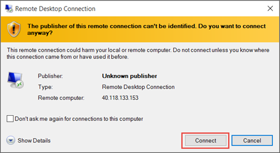

<properties services="virtual-machines" title="How to Log on to a Virtual Machine Running Windows Server" authors="cynthn" solutions="" manager="timlt" editor="tysonn" />

4. Als u op **Verbinden** klikt, wordt een Remote Desktop Protocol-bestand (.rdp) gemaakt en gedownload. Klik op **Openen** om dit bestand te gebruiken.

5. U ontvangt een waarschuwing dat het RDP-bestand van een onbekende uitgever is. Dit is normaal. Klik in het venster Extern bureaublad op **Verbinden** om door te gaan.

    

6. Typ in het venster **Windows-beveiliging** de referenties voor een account op de virtuele machine en klik vervolgens op **OK**.

    **Lokaal account** - Dit is meestal de gebruikersnaam en het wachtwoord van het lokaal account dat u hebt opgegeven toen u de virtuele machine hebt gemaakt. In dit geval is het domein de naam van de virtuele machine en het is ingevoerd als *vmname*&#92;*gebruikersnaam*.  
    
    **In het domein opgenomen VM** - Als de virtuele machine deel uitmaakt van een domein, voert u de gebruikersnaam in met de volgende indeling: *Domein*&#92;*Gebruikersnaam*. Het account moet bovendien in de groep Administrators staan of er moet een machtiging voor externe toegang zijn verleend aan de VM.
    
    **Domeincontroller** - Als de VM een domeincontroller is, gebruikt u de gebruikersnaam en het wachtwoord van een domeinbeheerdersaccount voor het domein.

7.  Klik op **Ja** om de identiteit van de virtuele machine te controleren en het aanmelden te voltooien.

    

<!--HONumber=Jun16_HO2-->

