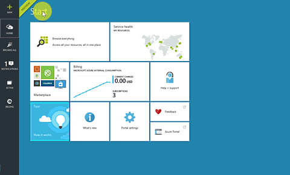
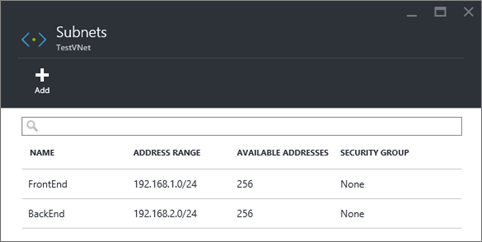

## Een VNet aanmaken in de Azure-portal

Volg de onderstaande stappen om een VNet aan te maken met behulp van de Azure Preview Portal op basis van het bovenstaande scenario .

1. Navigeer via een browser naar http://portal.azure.com en log, indien nodig, in met uw Azure-account.
2. Klik op **Nieuw** > **Netwerken** > **Virtueel netwerk** en vervolgens op **Resource Manager** vanuit de lijst **Selecteer een implementatiemodel**. Klik daarna op **Aanmaken**, zoals in de afbeelding hieronder wordt weergegeven.

    

3. Configureer de VNet-instellingen op de blade **Virtueel netwerk aanmaken**, zoals aangegeven in de onderstaande afbeelding.

    

4. Klik op **Resourcegroep** en selecteer een resourcegroep om toe te voegen aan het VNet of klik op **Nieuwe aanmaken** om het VNet toe te voegen aan een nieuwe resourcegroep. In de onderstaande afbeelding worden de instellingen voor de resourcegroep genaamd **TestRG** weergegeven. Zie [Azure Resource Manager Overview](../articles/resource-group-overview.md#resource-groups) (Overzicht van Azure Resource Manager) voor meer informatie over resourcegroepen.

    

5. Wijzig zo nodig de instellingen van het **Abonnement** en de **Locatie** voor uw VNet. 

6. Als u VNet niet als tegel wilt laten weergeven in het **Startboard** schakelt u **Vastmaken aan Startboard** uit. 

7. Klik op **Aanmaken** en let op de tegel met de naam **Virtueel netwerk aanmaken** die in de onderstaande afbeelding wordt weergegeven.

    

8. Wacht tot het VNet is aangemaakt en klik vervolgens, in de blade **Virtueel netwerk**, op **Alle instellingen** > **Subnetten** > **Toevoegen** zoals hieronder wordt weergegeven.

    

9. Geef de subnetinstellingen voor het *Back-end*-subnet op, zoals hieronder wordt weergegeven, en klik vervolgens op **OK**. 

    

10. Let op de lijst met subnetten, zoals wordt weergegeven in de afbeelding hieronder.

    

<!--HONumber=ago16_HO4-->

