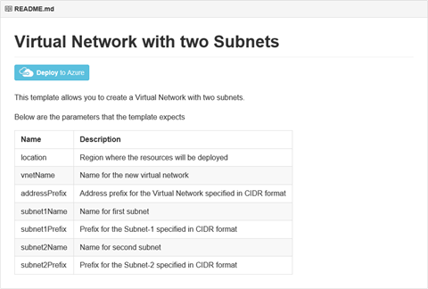
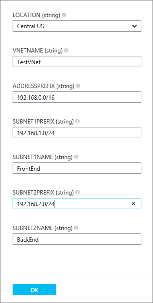

## De ARM-sjabloon implementeren met klik om te implementeren

U kunt vooraf gedefinieerde ARM-sjablonen hergebruiken door deze te uploaden naar een door Microsoft beheerde github-opslagplaats en toegankelijk voor de community. Deze sjablonen kunnen rechtstreeks uit de github geïmplementeerd worden of gedownload en gewijzigd worden zodat deze aansluiten op uw behoeften. Volg de onderstaande stappen voor het implementeren van een sjabloon die een VNet met twee subnetten maakt.

1. Vanuit een browser gaat u naar [https://github.com/Azure/azure-quickstart-templates](https://github.com/Azure/azure-quickstart-templates).
2. Scroll omlaag in de lijst met sjablonen en klik op **101-vnet-two-subnets**. Controleer het **README.md** -bestand, zoals hieronder weergegeven.

    

3. Klik op **Implementeren in Azure**. Voer indien nodig uw Azure-aanmeldingsreferenties in. 
4. Voer de waarden die u wilt gebruiken om uw nieuwe VNet te maken in de **Parameters**-blade en klik vervolgens op **OK**. De onderstaande afbeelding geeft de waarden voor ons scenario weer.

    

4. Klik op **Resourcegroep** en selecteer een resourcegroep om toe te voegen aan het VNet of klik op **Nieuwe aanmaken** om het VNet toe te voegen aan een nieuwe resourcegroep. In de onderstaande afbeelding worden de instellingen voor de resourcegroep genaamd **TestRG** weergegeven.

    

5. Wijzig zo nodig de instellingen van het **Abonnement** en de **Locatie** voor uw VNet.
6. Als u VNet niet als tegel wilt laten weergeven in het **Startboard** schakelt u **Vastmaken aan Startboard** uit.
5. Klik op **Juridische voorwaarden**, lees de voorwaarden en klik op **Kopen** om akkoord te gaan.  
6. Klik op **Maken** om het VNet aan te maken.

    

7. Als de implementatie is voltooid, klikt u op **TestVNet** > **Alle instellingen** > **subnetten** om de subneteigenschappen te bekijken, zoals hieronder weergegeven.

    

<!--HONumber=Jun16_HO2-->

