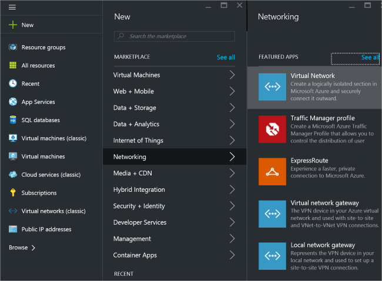
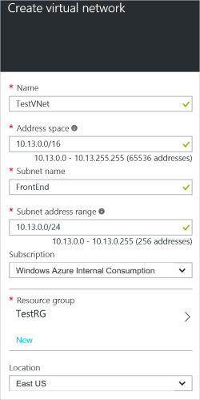

Volg de onderstaande stappen om een VNet aan te maken met behulp van de Azure Portal. Let op: de schermafbeeldingen dienen alleen als voorbeeld. Zorg dat u de waarden vervangt door die van uzelf. Bekijk het [Virtual Network-overzicht](../articles/virtual-network/virtual-networks-overview.md) voor meer informatie over het gebruik van virtuele netwerken.

1. Navigeer via een browser naar de [Azure Portal](http://portal.azure.com) en log, indien nodig, in met uw Azure-account.

2. Klik op **Nieuw** **>** **Netwerken** **>** **Virtueel netwerk**.

    

3. Kies, uit de lijst **Selecteer een implementatiemodel** aan de onderzijde van de blade virtueel netwerk, de optie **Resource Manager** en klik vervolgens op **Aanmaken**.

    

4. Configureer de VNet-instellingen op de blade **virtueel netwerk aanmaken**. Voeg uw eerste adresruimte en één adresbereik voor het subnet toe aan deze blade. Nadat u het VNet hebt aangemaakt, kunt u terugkeren en aanvullende subnets en adresruimten toevoegen. Dit is nog een beperking van de portal. Je kunt altijd terugkeren om deze waarden bij te werken door de eigenschappen van de VNet te bewerken in de portal of door PowerShell te gebruiken. De waarden die u gebruikt zijn afhankelijk van de configuratie die u wilt aanmaken. Zorg dat u verwijst naar uw geplande configuratiewaarden. 

    

5. Controleer of het **Abonnement** het juiste is. U kunt abonnementen wijzigen met behulp van de vervolgkeuzelijst.

6. Klik op **Resourcegroep** en selecteer een bestaande resourcegroep of maak een nieuwe aan door een naam in te voeren voor uw nieuwe resourcegroep. Geef de resourcegroep een naam die aansluit bij de geplande configuratiewaarden wanneer u een nieuwe groep aanmaakt. Zie voor meer informatie over resourcegroepen [Overzicht van Azure Resource Manager](resource-group-overview.md#resource-groups).

7. Selecteer vervolgens de **Locatie**-instellingen voor uw VNet. Houd er rekening mee dat de locatie bepaalt waar de resources die u in dit VNet implementeert, worden opgeslagen. U kunt dit later niet wijzigen zonder uw resources opnieuw te implementeren.

8. Selecteer **Vastmaken aan dashboard** als u uw VNet gemakkelijk wilt terugvinden op het dashboard en klik vervolgens op **Aanmaken**.
    
    

9. Nadat u op Aanmaken klikt, ziet u een tegel op uw dashboard die de voortgang van uw VNet aangeeft. De tegel wordt gewijzigd wanneer het VNet wordt gemaakt.

    

<!--HONumber=Sep16_HO3-->

